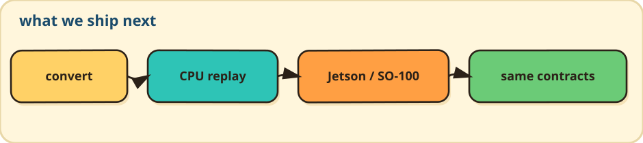

# Contributing to FlowEdge

Thanks for considering contributing to FlowEdge.

Contributions are welcome across model support, kernels, backends, benchmarking, APIs, documentation, and robotics integrations.

By participating you agree to the [Code of Conduct](CODE_OF_CONDUCT.md).

If GitHub shows “Issue creation is restricted,” use [Discussions](https://github.com/reforcemind/FlowEdge/discussions) for questions. Maintainers: GitHub Settings → Moderation → Interaction limits, and collaborator-only issue creation, must be off for public reports.

## Where to start

If you're new to the project, look for issues labeled:

* `good first issue` — small, well-scoped tasks suitable for first-time contributors
* `help wanted` — work where community contributions are especially welcome

Current starters: [#185](https://github.com/reforcemind/FlowEdge/issues/185) (Windows first-run), [#186](https://github.com/reforcemind/FlowEdge/issues/186) (gym PushT GIF).

CPU wheels for v0.1.2 are Release assets (filenames `flowedge-0.1.2-*`). A GitHub tag `vX.Y.Z` must match `project.version` in `pyproject.toml` so wheel names match the tag. CUDA stays a source backend.

For large features or architectural changes, please open or comment on an issue first so the scope and interface can be agreed before implementation.

## Development loop



issue → research comment → follow-up issues → one PR → review → evidence on main

1. **Issue.** State the problem, the smallest useful scope, what is out of scope, and the evidence that would close it. Use the research template when the design is not yet obvious.
2. **Research.** Comment on the issue with pinned checkpoints, shapes, hot kernels, and open questions. Do not open a PR yet. Split child issues if the parent is still too large.
3. **Implement.** One PR per issue, from `main`. Runtime changes must keep the zero-allocation hot path.
4. **Evidence.** Model work includes a parity command. Performance work includes same-host before/after medians. User-path changes update the relevant guide.

Current product: CPU Core (Mamba + flow, Diffusion Policy, Transformer decoder fixture, cached SmolVLA expert), LeRobot plugin, optional Relay. CUDA flow and DP heads are device-resident behind `nvcc`; matched GPU replay is [#163](https://github.com/reforcemind/FlowEdge/issues/163), LeRobot CUDA is [#164](https://github.com/reforcemind/FlowEdge/issues/164). Tenstorrent (Metal), π0, and ACT stay behind that evidence.

## Code bar

1. Remove work that does not need to exist.
2. Reuse an existing FlowEdge contract.
3. Prefer a zero-overhead standard or platform facility.
4. Write the smallest measured implementation.

Core compute and documented Relay hot paths allocate nothing after construction. Setup may use `std::expected`; hot paths do not throw. `FlowEdge::Core` never depends on Relay.

## Development environment

FlowEdge requires:

* CMake 3.21+
* a C++23 compiler

  * Clang 16+
  * GCC 13+
  * MSVC 19.38+

See the `README.md` and project documentation for full build and setup instructions.

Binary wheels are built with cibuildwheel (`pyproject.toml` `[tool.cibuildwheel]`)
for CPython 3.10–3.12 on native-arch manylinux_2_28 (x86_64 and aarch64 runners),
Windows AMD64, and macOS. A local `pip install .` still compiles with a C++23 toolchain.

A typical build with tests enabled is:

```bash
cmake -S . -B build -DCMAKE_BUILD_TYPE=Release -DFLOWEDGE_TESTS=ON
cmake --build build -j
ctest --test-dir build --output-on-failure
```

## Submitting a Pull Request

1. **Fork the repository** and create a branch from `main`.
2. **Keep the PR focused** on one logical change.
3. **Build and run the tests** before submitting. Parity (ULP, convert,
   diffusion python) is local: Grok Bot runs `scripts/verify_all.sh` or
   `scripts/verify_local.ps1`. GitHub Actions is compile + `ctest`.
4. **Follow the existing C++ style** and formatting conventions.
5. **Add or update tests** for changed behavior.
6. **Link the relevant issue** when applicable.
7. **Describe what changed and why** in the PR description.

For performance-sensitive changes such as kernels, scheduling, memory layout, model execution, or backends, include before/after benchmark results and the environment used to produce them.

Changes to the inference hot path should preserve FlowEdge's fixed-memory / allocation-free runtime behavior unless there is a strong reason not to.

## Reporting bugs

Before opening a bug report:

* check that the issue has not already been reported;
* use the bug report template;
* include the FlowEdge version or commit;
* include your OS, CPU/device, compiler, and relevant configuration;
* provide the smallest reproduction you can.

Logs and exact commands are especially helpful.

## Requesting features

Use the feature request template and explain:

* the use case;
* why the feature belongs in FlowEdge;
* the smallest useful scope;
* how the implementation could be validated.

For large features such as new backbones, action heads, or accelerator backends, defining the supported model/hardware scope up front is strongly preferred.

## Performance changes

FlowEdge is designed around deterministic, low-latency inference.

If your change affects performance, please include:

* CPU/device
* OS
* compiler
* build type
* FlowEdge commit
* benchmark configuration
* before/after results

Do not report speedups from runs performed on materially different environments.

## Questions

If you're unsure whether an idea fits the project, open a GitHub Discussion or comment on the relevant issue before starting a large implementation.
