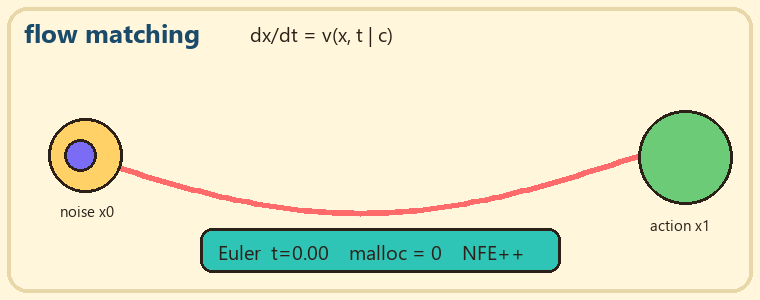
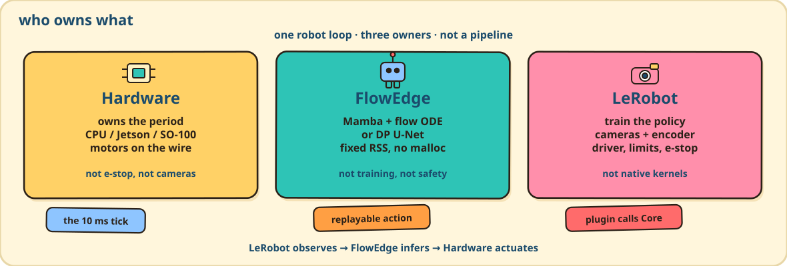
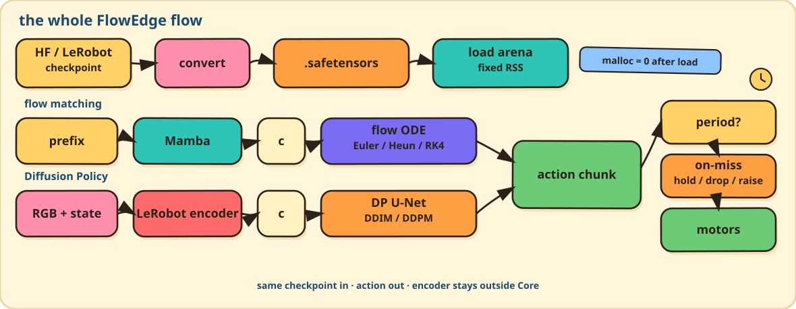
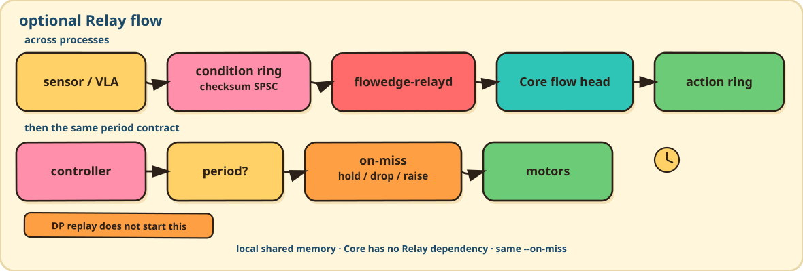
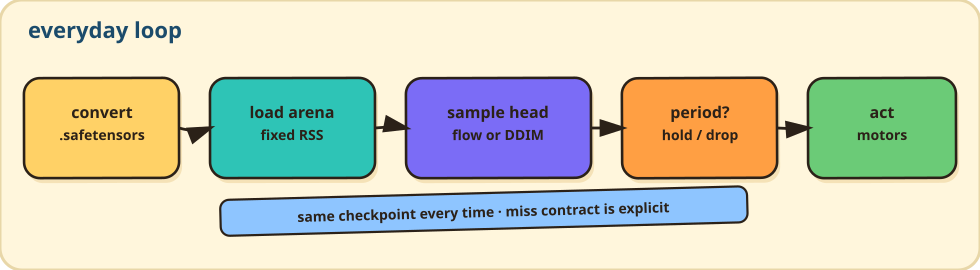
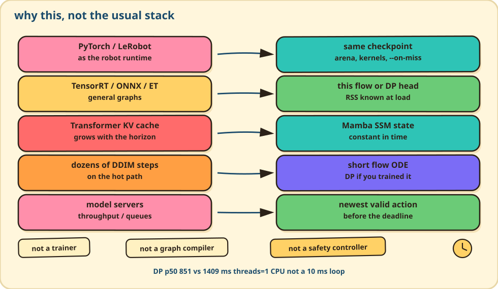
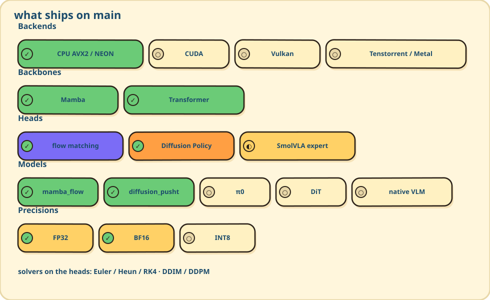

<div align="center">


# FlowEdge

**Low-latency inference for real-time robotics policies**

A C++23 inference runtime for robotics policies with fixed memory, deterministic execution, and explicit deadline handling. LeRobot still owns cameras, training, and the robot.

<br/>

&nbsp;**CPU** &nbsp;&nbsp;·&nbsp;&nbsp; &nbsp;**CUDA** &nbsp;&nbsp;·&nbsp;&nbsp; &nbsp;**Tenstorrent research track**

[Documentation](https://elprofesoriqo.github.io/FlowEdge/) &nbsp;&nbsp;·&nbsp;&nbsp; [Getting Started](https://elprofesoriqo.github.io/FlowEdge/getting-started.html) &nbsp;&nbsp;·&nbsp;&nbsp; [Python](https://elprofesoriqo.github.io/FlowEdge/python-quickstart.html) &nbsp;&nbsp;·&nbsp;&nbsp; [Performance](https://elprofesoriqo.github.io/FlowEdge/performance.html) &nbsp;&nbsp;·&nbsp;&nbsp; [Contributing](CONTRIBUTING.md)

</div>

<div align="center">
  
</div>

<p align="center"><em>Same load → warmup (malloc 0) → DDIM. CUDA 131 vs 345 ms. CPU 851 vs 1409 ms.</em></p>

## 📰 News

**🗓️ September 2026**

- ⚡ **19** — Split-K CUDA Conv1D on horizon 8 ([#183](https://github.com/elprofesoriqo/FlowEdge/pull/183)). Published GTX 1650 matched DDIM replay stays **131 vs 345 ms** vs PyTorch CUDA. Not a 10 ms loop.
- 🚀 **18** — Device-resident CUDA after load: flow head ([#167](https://github.com/elprofesoriqo/FlowEdge/pull/167)), Diffusion Policy U-Net + DDIM ([#168](https://github.com/elprofesoriqo/FlowEdge/pull/168), [#169](https://github.com/elprofesoriqo/FlowEdge/pull/169)), Mamba ([#173](https://github.com/elprofesoriqo/FlowEdge/pull/173)). Same-process CUDA vs PyTorch CUDA replay ([#170](https://github.com/elprofesoriqo/FlowEdge/pull/170)). LeRobot `--device cuda` period rollouts, same `--on-miss` ([#171](https://github.com/elprofesoriqo/FlowEdge/pull/171)).
- 📦 **17** — [v0.1.1](https://github.com/elprofesoriqo/FlowEdge/releases/tag/v0.1.1) CPU wheels for CPython 3.10–3.12 (manylinux x86_64/aarch64, Windows AMD64, macOS ARM). Not on PyPI. ⏱️ `--on-miss hold|drop|raise` in the LeRobot adapter ([#152](https://github.com/elprofesoriqo/FlowEdge/pull/152)). CPU fair-compare Diffusion Policy remains **851 vs 1409 ms**, `threads=1`.

🏷️ [Releases](https://github.com/elprofesoriqo/FlowEdge/releases) &nbsp;·&nbsp; 📈 [Performance](docs/performance.md)

***

## The problem

A robot loop is a deadline. At 100 Hz the motors want a new command every 10 ms. If this sample is late, they still need a defined action — hold the last one, skip the send, or fault — and that choice has to be replayable. `--on-miss hold|drop|raise` is that contract.

On the matched Diffusion Policy replay FlowEdge is faster than PyTorch: CPU **851 vs 1409 ms**, CUDA **131 vs 345 ms**. That is the fair compare. The 10 ms figure is the robot’s tick, not this checkpoint’s p50.

PyTorch, LeRobot, TensorRT, and generic model servers are good at training or at running arbitrary graphs. They are a weak fit as the thing inside that loop: heap allocations after warmup, a dispatcher, a growing KV cache, and a p50 that is not a miss count. Training code also tends to own cameras, normalization, and e-stop, which do not belong in the inference kernel.

## What FlowEdge does

Convert a pinned checkpoint once. Load it into one bump-allocated arena (weights, scratch, solver state). On each tick the engine samples **one of two policy heads**:

**Flow matching** — Mamba (or your encoder) produces a condition \(c\). The head is a velocity field \(v(x,t \mid c)\). Integrate a short ODE from noise \(x_0\) to action \(x_1\) with Euler / Heun / RK4. Cost is NFE × one velocity net. No RNG.

**Diffusion Policy** — LeRobot still encodes RGB. Core runs the Conv1D U-Net and DDIM (seeded DDPM for reference) on the action horizon. Cost is DDIM steps × one U-Net. Usually more NFE than a short flow ODE, which is why flow matching is the default and DP is the other first-class head when that is the trained checkpoint.

The engine sizes RSS at load and does not malloc on the supported hot path. Same observation, same action. If the period is missed, `--on-miss hold|drop|raise` is explicit. Encoders, joint limits, and e-stop stay in LeRobot (or your adapter). Optional Relay is local IPC around Core, not the default DP path.

<div align="center">
  
</div>

<div align="center">
  
</div>

<div align="center">
  
</div>

<div align="center">
  
</div>

<div align="center">
  
</div>

## Why this, not the usual stack

<div align="center">
  
</div>

Matched **Diffusion Policy** PushT replay, CPU, `threads=1`: policy p50 **851 ms** vs LeRobot/PyTorch **1409 ms**. It is not a 10 ms loop. On GTX 1650, the same matched replay is **131 ms** vs PyTorch CUDA **345 ms**. **Flow matching** is gated by ULP vs the same PyTorch reference (~1e-6 rel), not a published policy p50. Evidence: [performance](docs/performance.md).

## First run

CPU wheels for CPython 3.10–3.12 (manylinux x86_64/aarch64, Windows AMD64, macOS ARM) ship with [v0.1.1](https://github.com/elprofesoriqo/FlowEdge/releases/tag/v0.1.1). They are **not** on PyPI yet; download the wheel for your platform from the [cibuildwheel run](https://github.com/elprofesoriqo/FlowEdge/actions/runs/35243534582) linked in that release, then:

```bash
python -m pip install flowedge-*.whl
mkdir -p models
curl -L "https://huggingface.co/ReForceMind/mamba_flow/resolve/main/mamba_flow.safetensors" \
  -o models/mamba_flow.safetensors
python examples/core/flow_sample.py models/mamba_flow.safetensors euler 10
```

Those wheels are CPU. CUDA is `FLOWEDGE_BACKEND=cuda` with `nvcc` ([CUDA](docs/architecture/cuda.md)).

From source (C++23, CMake 3.21+):

```bash
cmake -S . -B build -DCMAKE_BUILD_TYPE=Release && cmake --build build -j
./build/flow_sample models/mamba_flow.safetensors euler 10
```

LeRobot Diffusion Policy (plugin + fake robot or SO-100 shim):

```bash
python -m pip install -e integrations/lerobot
python -m flowedge_dev pipeline convert models/diffusion_pusht \
  models/diffusion_pusht.flowedge.safetensors --arch diffusion
python -m flowedge_dev pipeline rollout models/diffusion_pusht.flowedge.safetensors \
  --steps 20 --threads 4 --period-ms 10 --on-miss hold
```

Relay (optional IPC — not on the DP replay path):

```bash
cmake -S . -B build-relay -DCMAKE_BUILD_TYPE=Release -DFLOWEDGE_RELAY=ON
cmake --build build-relay -j
FLOWEDGE_BUILD_DIR=build-relay ./scripts/relay_demo.sh models/mamba_flow.safetensors
```

`Engine.sample(..., method="euler"|"heun"|"rk4")`. More Python: [python-quickstart](docs/python-quickstart.md).

<div align="center">
  
</div>

```bash
python -m flowedge_dev --help
```

Local merge gate: `scripts/verify_all.sh` or `scripts/verify_local.ps1`. GitHub Actions is compile + `ctest`.
