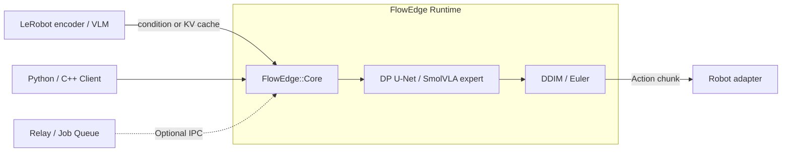

<div align="center">


# FlowEdge

**Run a trained LeRobot policy in a fixed-memory C++ runtime.**

Convert the checkpoint, keep the encoder in LeRobot, and measure the control period.

[Documentation](https://elprofesoriqo.github.io/FlowEdge/) &nbsp;&nbsp;·&nbsp;&nbsp; [Getting Started](https://elprofesoriqo.github.io/FlowEdge/getting-started.html) &nbsp;&nbsp;·&nbsp;&nbsp; [LeRobot](https://elprofesoriqo.github.io/FlowEdge/guides/lerobot.html) &nbsp;&nbsp;·&nbsp;&nbsp; [Performance](https://elprofesoriqo.github.io/FlowEdge/performance.html) &nbsp;&nbsp;·&nbsp;&nbsp; [Contributing](CONTRIBUTING.md)

</div>

***

FlowEdge is a C++23 inference runtime for robotics action policies. It owns
fixed-shape Diffusion Policy and SmolVLA action-expert execution, a zero-heap
hot path, and a deadline-aware LeRobot plugin. Observation encoders, joint
limits, and emergency-stop stay in LeRobot or the robot adapter.

Current CPU Diffusion Policy is **correct and not yet faster than PyTorch**.
The published `diffusion_pusht` replay is 8.55× slower than LeRobot on the
reference host; closing that gap is the first engineering target. SmolVLA
support is a native action expert behind a cached VLM contract, not a full
native VLM.

## Convert, run, measure

```bash
python -m pip install .
python -m pip install -e integrations/lerobot
hf download lerobot/diffusion_pusht --revision 84a7c23178445c6bbf7e1a884ff497017910f653 \
  --local-dir models/diffusion_pusht
python convert/convert.py models/diffusion_pusht \
  models/diffusion_pusht.flowedge.safetensors --arch diffusion --dtype f32
flowedge-lerobot-rollout models/diffusion_pusht.flowedge.safetensors \
  --steps 10 --threads 4 --period-ms 10 --on-miss hold
```

The command prints JSON: `p50_ms`, `p99_ms`, `missed_deadlines`, `on_miss`,
`peak_rss_bytes`. `--on-miss` is `hold` (repeat last sent action, zeros if none),
`drop` (skip `send_action`), or `raise` (`DeadlineMissed`). Joint-limit clamps
stay in the robot adapter.

`--policy.type=flowedge` loads a converted Diffusion Policy. `--policy.type=flowedge_smolvla`
loads the native action expert and a LeRobot VLM cache provider.

See the [LeRobot guide](docs/guides/lerobot.md) for the plugin boundary and the
[benchmark map](docs/benchmarks.md) for the captured replay.

## What it owns

- static runtime memory with zero heap allocations after engine initialization
- native `.safetensors` loading and checkpoint conversion
- C++, C API, and Python interfaces
- deterministic state snapshot and restore
- optional Relay layer for deadline-aware local inference

The implemented backend is CPU (AVX2 / NEON). Extra accelerators are not a
product claim until a user policy beats PyTorch on this path.

<details>
<summary><b>C++ Mamba smoke path (CI fixture, not the product default)</b></summary>

Requires CMake 3.21+ and a C++23 compiler. Clang 23 and CMake 4.4 are validated on Windows; GCC 13 and CMake 3.28 are validated on Linux.

```bash
cmake -S . -B build -DCMAKE_BUILD_TYPE=Release
cmake --build build -j
mkdir -p models
wget -qO models/mamba_flow.safetensors \
  https://huggingface.co/ReForceMind/mamba_flow/resolve/main/mamba_flow.safetensors
./build/flow_sample models/mamba_flow.safetensors euler 10
```

```bash
python -m pip install .
python examples/core/flow_sample.py models/mamba_flow.safetensors
```

The included smoke checkpoint contains the required `backbone.*` Mamba tensors and `flow.*` action-head tensors.
</details>

## Architecture



The allocation-free execution path lives in `src/core/` and is exported to CMake consumers as
`FlowEdge::Core`. Model loading may allocate once for weights and runtime setup; repeated
inference is allocation-free. Core does not depend on transport, telemetry, ROS, or daemon
libraries.

Installed CMake consumers should link `FlowEdge::Core` or `FlowEdge::Relay`; `FlowEdge::flowedge_engine` remains available as a compatibility target.

<details>
<summary><b>Optional FlowEdge Relay</b></summary>

Relay is the local systems layer around `FlowEdge::Core`: shared-memory IPC,
deadline-aware admission, cancellation, preallocated workers, and traces.
No LeRobot rollout requires it. Build with `-DFLOWEDGE_RELAY=ON`. See the
[Relay quickstart](docs/guides/relay-quickstart.md).

</details>

## Verification

```bash
cmake -S . -B build -DFLOWEDGE_TESTS=ON -DFLOWEDGE_BENCH=ON
cmake --build build -j
ctest --test-dir build --output-on-failure
```

On Linux: `./scripts/test.sh`, `./scripts/bench.sh`, `./scripts/verify_all.sh`.

### Allocation contract

Loading a model may allocate weights, loader metadata, and fixed runtime state.
After the engine and worker pool are initialized, the supported inference and
Relay hot paths must perform zero heap allocations.

## Contributing

Current product focus is a faster Diffusion Policy drop-in and a SmolVLA
cached-expert LeRobot path. See [CONTRIBUTING.md](CONTRIBUTING.md).

- [`good first issue`](https://github.com/elprofesoriqo/FlowEdge/labels/good%20first%20issue)
- [`help wanted`](https://github.com/elprofesoriqo/FlowEdge/labels/help%20wanted)
- [Discussions](https://github.com/elprofesoriqo/FlowEdge/discussions)

## Scope

FlowEdge does not provide model training, dataset pipelines, general-purpose
graph execution, built-in vision/language encoders, distributed scheduling, or
robot safety control. PyTorch, ONNX Runtime, TensorRT, and llama.cpp solve
broader or different inference problems. FlowEdge focuses on predictable
execution of fixed robotics policies and the control-loop contract around that
deployment path.
