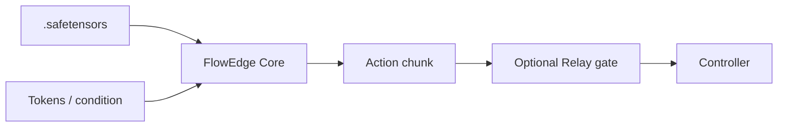
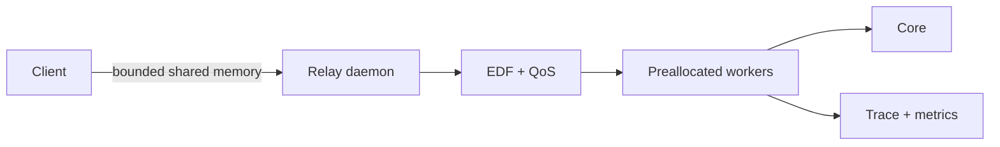

# FlowEdge

**Predictable inference for real-time robotics policies.**

FlowEdge is a C++23 runtime for fixed-shape Mamba and action-head inference. It is designed for
small, measurable control loops: static runtime memory, deterministic state, and zero heap
allocations after setup on supported hot paths.

| Current | Boundary |
|---|---|
| Mamba + flow matching | CPU scalar / AVX2 / NEON |
| Fixed LeRobot Diffusion Policy head | FP32 / BF16 `.safetensors` |
| C ABI, CMake, Python | Optional local Relay service |
| Snapshots, migration, traces, metrics | No training or perception |

[Documentation](https://elprofesoriqo.github.io/FlowEdge/) ·
[Getting started](https://elprofesoriqo.github.io/FlowEdge/getting-started.html) ·
[Performance](https://elprofesoriqo.github.io/FlowEdge/performance.html) ·
[Discussions](https://github.com/elprofesoriqo/FlowEdge/discussions)

## Quick start

```bash
cmake -S . -B build -DCMAKE_BUILD_TYPE=Release
cmake --build build --parallel
mkdir -p models
wget -qO models/mamba_flow.safetensors \
  https://huggingface.co/ReForceMind/mamba_flow/resolve/main/mamba_flow.safetensors
./build/flow_sample models/mamba_flow.safetensors euler 10
```

Python:

```bash
python -m pip install .
python examples/flow_sample.py models/mamba_flow.safetensors
```

## Runtime flow



| Use case | Entry point |
|---|---|
| Full Mamba + flow policy | `flow_sample` |
| Existing VLA/vision encoder | `external_flow_sample` or `sample_condition` |
| Streaming state | `mamba_forward`, `streaming_snapshot` |
| Cross-process inference | `scripts/relay_demo.sh` |
| Safe action delivery | `action_delivery_sample` |
| Generic stateful work | `cooperative_job_sample`, `routed_job_sample` |
| LeRobot deployment seam | `integrations/lerobot` |

## Relay



```bash
cmake -S . -B build-relay -DCMAKE_BUILD_TYPE=Release -DFLOWEDGE_RELAY=ON
cmake --build build-relay --parallel
FLOWEDGE_BUILD_DIR=build-relay ./scripts/relay_demo.sh models/mamba_flow.safetensors
```

## Performance reference

Smoke checkpoint, matched PyTorch CPU reference, lower is better:

| Path | FlowEdge | Reference | Result |
|---|---:|---:|---:|
| Mamba forward, Windows | 0.091 ms | 1.650 ms | 18.1x |
| Mamba forward, Linux | 0.071 ms | 0.990 ms | 13.9x |
| Action p99, Windows | 0.579 ms | 2.277 ms | 3.93x |
| Action p99, Linux | 0.650 ms | 1.695 ms | 2.61x |

These are reference measurements, not deployment guarantees. Reproduce them with the
[performance guide](docs/performance.md).

## Verification

```bash
cmake -S . -B build \
  -DFLOWEDGE_TESTS=ON -DFLOWEDGE_BENCH=ON -DFLOWEDGE_RELAY=ON
cmake --build build --parallel
ctest --test-dir build --output-on-failure
FLOWEDGE_BUILD_DIR=build ./scripts/lint.sh
FLOWEDGE_BUILD_DIR=build-all ./scripts/verify_all.sh models/mamba_flow.safetensors
```

The release gate checks tests, examples, Relay/job demos, benchmarks, installation, size budgets,
setup allocations, and hot-path allocations.

## Contracts

| Contract | Meaning |
|---|---|
| Allocation | Load/setup may allocate; supported hot paths allocate zero afterward |
| Ownership | One engine owns one mutable stream or active solve |
| Identity | Model digest/schema must match before restore or migration |
| Safety | Relay gates freshness and bounds; the robot owns final safety |
| Scope | No training, datasets, perception, arbitrary graphs, or distributed scheduling |

## Planned

Transformer + KV cache, CUDA/Metal/Vulkan/Tenstorrent backends, external runtime adapters, ROS 2,
and Zenoh remain planned. See [capabilities](docs/capabilities.md) and [roadmap](docs/roadmap.md).

## Contributing

See [CONTRIBUTING.md](CONTRIBUTING.md), open issues, or start a discussion. Changes should include
tests, a reproducible benchmark when performance-related, and explicit allocation behavior.
