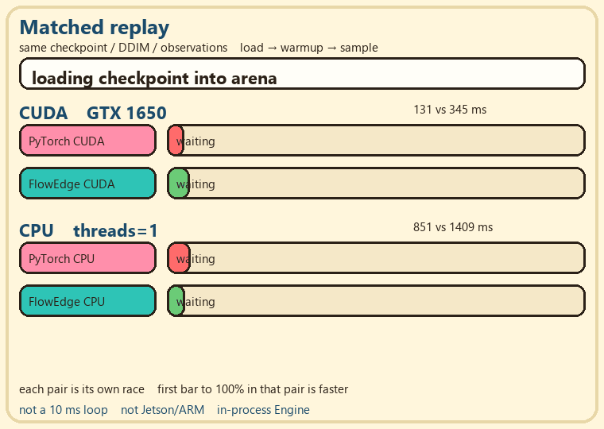
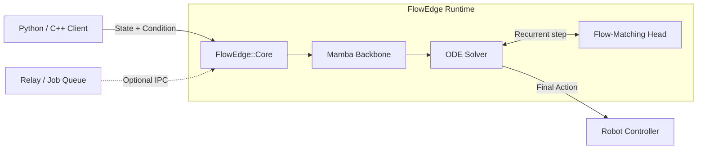
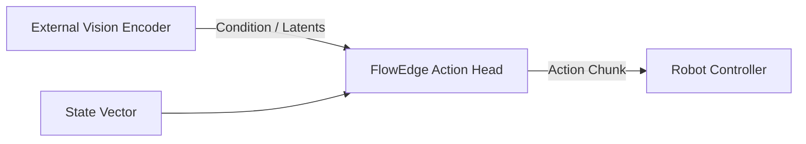

<div align="center">


# FlowEdge

**Low-latency inference for real-time robotics policies**

Flow-matching action policies, static memory, deterministic execution, and deadline-aware local inference.

<br/>

⚙️ **CPU** &nbsp;&nbsp;·&nbsp;&nbsp; &nbsp;**CUDA** &nbsp;&nbsp;·&nbsp;&nbsp; &nbsp;**TT-Metal**

[Documentation](https://elprofesoriqo.github.io/FlowEdge/) &nbsp;&nbsp;·&nbsp;&nbsp; [Getting Started](https://elprofesoriqo.github.io/FlowEdge/getting-started.html) &nbsp;&nbsp;·&nbsp;&nbsp; [Performance](https://elprofesoriqo.github.io/FlowEdge/performance.html) &nbsp;&nbsp;·&nbsp;&nbsp; [Contributing](CONTRIBUTING.md) &nbsp;&nbsp;·&nbsp;&nbsp; [Discussions](https://github.com/elprofesoriqo/FlowEdge/discussions)

</div>

***

<div align="center">
  
</div>

## Performance Highlights

On the included deterministic smoke checkpoint, FlowEdge reaches up to **18.1x faster Mamba backbone inference** and a **3.93x p99 action-latency speedup** over the matched PyTorch CPU reference.

See [Performance](#performance) for methodology and complete results.

## What is FlowEdge?

FlowEdge is a C++23 inference runtime for low-latency robotics policies, currently focused on Mamba backbones and flow-matching action heads:
- static runtime memory with zero heap allocations after engine initialization
- native `.safetensors` loading and checkpoint conversion
- C++, C API, and Python interfaces
- deterministic state snapshot and restore
- optional Relay layer for deadline-aware local inference

## Accelerators

Checked items are available on the current `main` branch.

- ☑ CPU (AVX2 / NEON)
- ☐ CUDA
- ☐ Metal
- ☐ Vulkan

## Architectures & Heads

Checked items are available on the current `main` branch.

**Backbones:**
- ☑ Mamba selective-SSM
- ☐ Transformer

**Heads (Action Policies):**
- ☑ Flow-Matching CNF
- ☑ Diffusion Policy (fixed LeRobot head)
- ☐ π0
- ☐ DiT

**ODE Solvers:**
- ☑ Euler
- ☑ Heun
- ☑ RK4

**Precision:**
- ☑ FP32
- ☑ BF16
- ☐ INT8

## Quick Start

<details open>
<summary><b>C++: build and sample</b></summary>

Requires CMake 3.21+ and a C++23 compiler. Clang 23 and CMake 4.4 are validated on Windows; GCC 13 and CMake 3.28 are validated on Linux.

**Build**
```bash
cmake -S . -B build -DCMAKE_BUILD_TYPE=Release
cmake --build build -j
```

**Download checkpoint**
```bash
mkdir -p models
wget -qO models/mamba_flow.safetensors \
  https://huggingface.co/ReForceMind/mamba_flow/resolve/main/mamba_flow.safetensors
```

The included smoke checkpoint contains the required `backbone.*` Mamba tensors and `flow.*` action-head tensors.

**Run**
```bash
./build/flow_sample models/mamba_flow.safetensors euler 10
```
</details>

<details>
<summary><b>Python: install and sample</b></summary>

```bash
python -m pip install .
python examples/flow_sample.py models/mamba_flow.safetensors
```

The Python package uses the same C++ engine. Use `Engine.sample(prefix, noise, steps, method)` with `euler`, `heun`, or `rk4`.
</details>

For external encoders, streaming inference, Relay, and cooperative jobs, see the [capability guide](docs/capabilities.md).

## Architecture



The allocation-free execution path lives in `src/core/` and is exported to CMake consumers as
`FlowEdge::Core`. Model loading may allocate once for weights and runtime setup; repeated
inference is allocation-free. Core does not depend on transport, telemetry, ROS, or daemon
libraries.

Installed CMake consumers should link `FlowEdge::Core` or `FlowEdge::Relay`; `FlowEdge::flowedge_engine` remains available as a compatibility target.

## FlowEdge Relay

Relay is the optional local systems layer around `FlowEdge::Core`.


It adds:
- shared-memory IPC
- deadline-aware admission
- cancellation and freshness handling
- preallocated worker pools
- state migration
- iterative and streaming cooperative jobs
- traces and fixed-memory metrics

Build with:

```bash
cmake -S . -B build-relay \
  -DCMAKE_BUILD_TYPE=Release \
  -DFLOWEDGE_RELAY=ON

cmake --build build-relay -j
```

## Performance

Mamba backbone forward with one CPU thread and matched checkpoint/input. Lower is better.

> These results use the included deterministic smoke checkpoint. They are not yet a production-policy benchmark.

| Backend | FlowEdge | PyTorch | Speedup |
| :--- | ---: | ---: | ---: |
| CPU (Windows) | 0.091 ms | 1.650 ms | **18.1x** |
| CPU (Linux) | 0.071 ms | 0.990 ms | **13.9x** |

### End-to-end action latency

| Platform | FlowEdge p99 | PyTorch p99 | Speedup |
| :--- | ---: | ---: | ---: |
| Windows | 0.579 ms | 2.277 ms | **3.93x** |
| Linux | 0.650 ms | 1.695 ms | **2.61x** |

See [performance](docs/performance.md#backbone-forward) for methodology and exact commands.

### Diffusion Policy

The fixed LeRobot `diffusion_pusht` head is available through the current CPU backend. On the pinned
public checkpoint, a single denoiser measured **365.4 ms p50** and a 10-step DDIM sample measured
**3.765 s p50** with four workers. Dense-kernel optimization currently ranges from **1.09x to
3.18x** against the pre-optimization implementation; these are reference measurements, not
real-time guarantees.

### Relay and cooperative jobs

Measured on the documented Windows and Linux hosts; lower latency and higher throughput are better.

| Benchmark | Windows | Linux |
| --- | ---: | ---: |
| Relay synchronous p99 | 47.60 us | 40.10 us |
| Relay pool, 2 workers | 73,187 req/s | 109,507 req/s |
| Migrate and finish | 478.56 ns/job | 292.08 ns/job |
| Shared-memory job service + pool + metrics | 4.60 us/job | 1.78 us/job |

The complete [performance report](docs/performance.md) also covers deadline dispatch, Mamba stream
migration, worker draining, action delivery, QoS overload admission, binary-size budgets, and the
initialization/hot-path allocation checks. Current verification records stable initialization
allocations and **zero allocations during repeated inference**.

## External encoder / head-only usage



FlowEdge can run only the action-policy path while observation encoding is handled by another process, model, or accelerator. Use the head-only routines in `Engine.sample` or the C++ equivalent.

## Verification

Run the local test and benchmark suite:

```bash
cmake -S . -B build \
  -DFLOWEDGE_TESTS=ON \
  -DFLOWEDGE_BENCH=ON

cmake --build build -j
ctest --test-dir build --output-on-failure
```

On Linux:

```bash
./scripts/test.sh
./scripts/bench.sh
./scripts/verify_all.sh
```

Relay-specific verification and benchmark commands are documented in the [performance](docs/performance.md) and Relay guides.

## Integrations and capabilities

The current runtime covers both in-process control loops and a local multi-process deployment:

| Use case | Entry point | Result |
| --- | --- | --- |
| Mamba + flow policy | `flow_sample` | Tokens to a deterministic action chunk |
| Existing VLA/vision encoder | `external_flow_sample` or head-only API | Condition vector to FlowEdge action head |
| Incremental decoding | `mamba_forward` | Persistent Mamba recurrence state |
| State transfer | `streaming_snapshot` | Exact continuation in another engine |
| Live stream migration | `mamba_relay_stream` | Resume tokens on another Relay lane |
| Cross-process action service | `scripts/relay_demo.sh` | Client, daemon, deadlines, replay, and metrics |
| Fresh action delivery | `action_delivery_sample` | Freshness, overlap, bounds, and rate limits |
| Custom stateful work | `cooperative_job_sample` | Iterative, streaming, or speculative jobs |
| Cross-process custom work | `routed_job_sample` | Typed results, lifecycle metrics, and traces |
| Managed Mamba streams | `scripts/job_demo.sh` | QoS, lane recovery, traces, and metrics |

Available interfaces and runtime features include:

- C, CMake (`FlowEdge::Core` and `FlowEdge::Relay`), and Python APIs.
- Mamba streaming and flow heads with Euler, Heun, and RK4 solvers.
- A fixed LeRobot Diffusion Policy head, FP32/BF16 safetensors, and immutable shared weights.
- CPU scalar/AVX2/NEON backends with adaptive worker placement.
- Versioned snapshots, canonical job capsules, exact restore, and model identity checks.
- Relay shared-memory transport, EDF scheduling, cancellation, freshness, safe action delivery,
  cooperative jobs, QoS reservations, drain/quarantine/recovery, portable traces, and fixed-memory
  Prometheus/JSON/OTLP metrics.

ROS 2, Zenoh, CUDA, Metal, Vulkan, TTNN, Transformer, and external runtime adapters remain planned;
see the [capability matrix](docs/capabilities.md) for the current boundary.

### Allocation contract

FlowEdge separates one-time initialization from the control loop. Loading a model may allocate
weights, loader metadata, and fixed runtime state. After the engine and worker pool are initialized,
the supported inference and Relay hot paths must perform zero heap allocations. The verification
report checks this contract across repeated `load -> run -> free` cycles and fails on any hot-path
allocation. A stricter caller-owned, zero-allocation load API is tracked in
[issue #63](https://github.com/elprofesoriqo/FlowEdge/issues/63).

## Contributing

Contributions are welcome in models, kernels, deployment tooling, backends,
benchmarks, and integrations.

- [`good first issue`](https://github.com/elprofesoriqo/FlowEdge/labels/good%20first%20issue)
- [`help wanted`](https://github.com/elprofesoriqo/FlowEdge/labels/help%20wanted)
- [Discussions](https://github.com/elprofesoriqo/FlowEdge/discussions)

See [CONTRIBUTING.md](CONTRIBUTING.md) for the development workflow.

## Scope

FlowEdge deliberately does not try to provide:

- model training
- dataset pipelines
- general-purpose graph execution
- built-in vision/language encoders
- distributed cluster scheduling
- robot safety control

PyTorch, ONNX Runtime, TensorRT, and llama.cpp solve broader or different
inference problems. FlowEdge focuses on predictable execution of fixed
robotics policies and the systems contracts around that deployment path.
