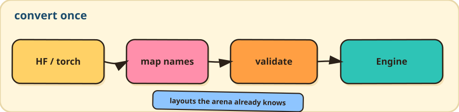

# convert — checkpoint → FlowEdge `.safetensors`



Fixed layouts: `backbone.*` (Mamba), `flow.*` (flow head), `dp.*` (Diffusion Policy U-Net).

```bash
python -m flowedge_dev pipeline convert <source> models/out.safetensors \
  --arch mamba|diffusion|transformer [--dtype f32|bf16]
```

`<source>` is a `.safetensors` / `.pt` / directory. Diffusion may be a LeRobot model dir.

## mamba

Hugging Face `state-spaces/mamba-*`. Embedding key normalized; unused state dropped. `flow.*` passes through.

## diffusion (LeRobot)

`lerobot/diffusion_pusht` `ConditionalUnet1D`. Keeps the action U-Net and MIN_MAX stats; drops the ResNet encoder. Runtime input is the flattened condition (132 floats on the reference checkpoint).

```bash
hf download lerobot/diffusion_pusht --revision 84a7c23178445c6bbf7e1a884ff497017910f653 \
  --local-dir models/diffusion_pusht
python -m flowedge_dev pipeline convert models/diffusion_pusht \
  models/diffusion_pusht.flowedge.safetensors --arch diffusion --dtype f32
python -m flowedge_dev pipeline inspect models/diffusion_pusht --json
```

Supports `squaredcos_cap_v2`, epsilon prediction, FiLM, GroupNorm, MIN_MAX. Converted files carry a deployment profile for `flowedge-inspect`.

## transformer (incubator)

GPT-2-style decoder for kernel work. Not a product policy. Excludes tokenization, LM head, and SmolVLA (RMSNorm / RoPE / GQA / SwiGLU need the expert path).

```bash
python -m flowedge_dev pipeline convert models/tiny-gpt2 \
  models/tiny-gpt2.flowedge.safetensors --arch transformer
```
