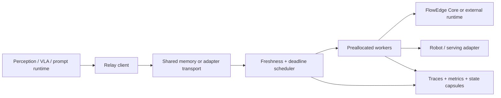

# Suggested issue title

`feat(relay): deadline-aware cooperative inference systems layer (src/relay/)`

Copy the Markdown below into the GitHub issue body. Checked items describe the implementation on
`relay-production-hardening`; unchecked items are follow-up work.

---

## Goal

Build **FlowEdge Relay**, an optional C++23 systems layer for predictable, deadline-aware and
resumable inference in robotics, embodied AI, ML systems, and stateful LLM serving.

Relay lives beside the engine in the FlowEdge repository:

```text
src/
├── core/    # dependency-free inference engine and kernels
└── relay/   # scheduling, workers, transport, migration and observability
```

`FlowEdge::Core` remains small and embeddable. `FlowEdge::Relay` depends on Core and adds the
infrastructure required to run stateful model workloads under latency, freshness, cancellation, and
resource constraints.

The objective is not another general-purpose model server. Relay should solve the systems problems
that throughput-oriented serving stacks handle poorly: cancelling stale robot-policy work, proving
deadline feasibility, cooperatively preempting long jobs, migrating state without replay, sharing
weights across isolated workers, and retaining deterministic traces and bounded telemetry.

## Architecture



The dependency direction remains one-way:

```text
applications/adapters -> FlowEdge::Relay -> FlowEdge::Core
```

Core must not depend on Relay, ROS 2, Zenoh, gRPC, OpenTelemetry, CUDA, TTNN, PyTorch, or another
serving framework.

## Implemented foundation

### Transport and lifecycle

- [x] Keep Relay under `src/relay/` and export it separately as `FlowEdge::Relay`.
- [x] Add versioned condition, action, control, and model-identity contracts.
- [x] Add compact checksummed SPSC shared-memory messages on Windows and POSIX.
- [x] Add a move-only typed `RelayClient`.
- [x] Add `flowedge-relayd`, `flowedge-relayctl`, and `flowedge-relay-trace`.
- [x] Add real cross-process daemon/client integration tests.

### Scheduling and workers

- [x] Add bounded earliest-deadline-first scheduling.
- [x] Treat generation as a freshness and cancellation high-watermark.
- [x] Return typed stale, deadline, capacity, expiry, cancellation, and failure outcomes.
- [x] Add calibrated nanoseconds-per-NFE admission.
- [x] Simulate deadline admission over all active and queued worker lanes.
- [x] Add a preallocated pool of 1–8 workers.
- [x] Keep mutable engine state and scratch private to each worker.
- [x] Load checkpoint tensors once and share immutable weights across workers.
- [x] Add `none`, `compact`, and `spread` NUMA-aware placement policies.
- [x] Preserve zero hot-path heap allocations.

### Replay and observability

- [x] Add portable little-endian condition/action traces with checksums.
- [x] Add trace inspection, JSONL output, and deterministic replay.
- [x] Add fixed-memory counters and latency histograms.
- [x] Export Prometheus text, compact JSON, and OTLP/HTTP JSON.
- [x] Keep telemetry recording outside the allocation and compute paths.

### Generic cooperative execution

- [x] Add a versioned `JobDescriptor` with workload kind, model digest, schema, session, generation,
  deadline, and exact work count.
- [x] Add allocation-free non-owning type erasure over caller-owned model backends.
- [x] Check every backend advance against the admitted budget and remaining work.
- [x] Add explicit ready, running, complete, cancelled, and failed states.
- [x] Add concept-based iterative, streaming, and speculative factories.
- [x] Add canonical little-endian state capsules with whole-record fingerprints.
- [x] Reject corruption, truncation, version, model, schema, and job mismatches before backend import.
- [x] Add endian-stable integer and float payload codecs.
- [x] Add bit-exact migration, cancellation, corruption, and incompatibility tests.
- [x] Add an allocation-checked migration benchmark and runnable example.

## Next scope

### Generic worker routing

- [x] Add generic job request/result message kinds without breaking the flow condition/action v1 path.
- [x] Route registered job adapters through a bounded preallocated worker pool and multi-lane admission model.
- [x] Add bounded adapter registration with stable model/schema identity.
- [x] Add per-kind work-cost calibration rather than assuming one NFE cost.
- [x] Extend traces and metrics with job kind, schema, work progress, migration, and preemption events.
- [x] Add typed generic-job client/service endpoints and prove the real process boundary.

### Robotics adapters

- [ ] Add action-chunk overlap and replacement policy.
- [ ] Add a controller-side freshness and final safety gate.
- [ ] Add optional ROS 2 request/action integration.
- [ ] Add optional Zenoh transport integration.
- [ ] Define clock-domain and timestamp synchronization contracts.
- [ ] Add a multi-rate perception/policy/control-loop example.

### ML and LLM adapters

- [ ] Adapt iterative diffusion and DiT denoising.
- [ ] Adapt Mamba/SSM streaming decode state.
- [ ] Adapt transformer KV-cache streaming once #10 lands.
- [ ] Add speculative draft, verify, commit, and rollback state.
- [ ] Add optional ONNX Runtime, TensorRT, PyTorch, llama.cpp/vLLM, and generic inference-server
  adapters without making them Relay dependencies.
- [ ] Add worker draining and live session migration examples.

## Performance report

Report warm steady-state results separately from startup and model loading.

- [ ] Request throughput and completed work units per second.
- [ ] Queue, execution, and end-to-end p50/p95/p99/p999 latency.
- [ ] Cancellation detection latency.
- [ ] State-capsule export/import latency by payload size.
- [ ] Generic adapter dispatch overhead per work unit.
- [ ] Worker scaling from 1 to 8 workers.
- [ ] Shared-weight bytes versus per-worker mutable bytes.
- [ ] Compact versus spread NUMA placement.
- [ ] Hot-path allocation count.
- [ ] Windows and Linux results with exact compiler, CPU, affinity, model, and command.

Performance claims must use identical checkpoints, inputs, solver configuration, thread counts, and
thermal conditions.

An initial dated Windows/Linux reference covering Core latency, Relay latency/throughput, one/two-worker
scaling, shared-weight bytes, and allocation-free cooperative migration is published in
[`docs/performance.md`](https://github.com/elprofesoriqo/FlowEdge/blob/main/docs/performance.md).

## Correctness requirements

- [ ] A stale generation is never published as a successful current result.
- [ ] Admission considers active and queued work across every enabled worker.
- [ ] Cooperative execution is deterministic for fixed model, input, state, and work sequence.
- [ ] Migrated execution produces the same final result as uninterrupted execution.
- [ ] Invalid capsules fail before destination state is committed.
- [ ] Worker failure cannot corrupt another worker's mutable state.
- [ ] Shared immutable weights cannot be modified by a worker.
- [ ] Begin, advance, cancel, scheduling, recording, and migration allocate nothing after setup.
- [ ] Windows and Linux pass the same public surface.

## Out of scope

- Training loops, datasets, optimizers, or a general graph runtime.
- Bundling ROS 2, Zenoh, inference servers, accelerator runtimes, or telemetry SDKs into Core.
- Claiming hard real-time guarantees without OS and deployment-level validation.
- Migration between incompatible model digests or state schemas.
- Distributed scheduling before local traces demonstrate the need.
- Replacing TTNN, CUDA, TensorRT, ONNX Runtime, or another execution runtime.

Relay coordinates these runtimes through optional adapters.

## Acceptance criteria

- [ ] `FlowEdge::Core` remains usable without building Relay.
- [ ] `FlowEdge::Relay` remains an independent optional CMake target.
- [ ] The current flow-head daemon/client path stays backward compatible.
- [ ] Iterative, streaming, and speculative workloads use one checked cooperative contract.
- [ ] At least one production FlowEdge model uses the generic contract.
- [ ] A running job migrates to another compatible worker and completes deterministically.
- [ ] Examples cover lifecycle, deadlines, cancellation, replay, metrics, and migration.
- [ ] Benchmarks cover single-worker, multi-worker, and generic cooperative-job paths.
- [ ] Tests, examples, scripts, docs, installation, and benchmarks pass on Windows and Linux.

## Related FlowEdge issues

- #9 — Diffusion Policy action head: iterative denoising workload.
- #10 — Transformer backbone: KV-cache streaming and preemptible decode.
- #11 — π0 flow-matching action: external VLM plus bounded action generation.
- #13 — Performance and multiprocessing: threading, scratch ownership, SIMD, and memory behavior.
- #14 — Tenstorrent TTNN backend: accelerator execution coordinated without absorbing TTNN into Core.

## Design references

- [FlowEdge Relay proposal](https://github.com/elprofesoriqo/FlowEdge/blob/main/docs/ecosystem/relay-proposal.md)
- [Cooperative execution](https://github.com/elprofesoriqo/FlowEdge/blob/main/docs/architecture/cooperative-execution.md)
- [Cooperative jobs and migration](https://github.com/elprofesoriqo/FlowEdge/blob/main/docs/guides/cooperative-jobs.md)
- [Relay observability](https://github.com/elprofesoriqo/FlowEdge/blob/main/docs/guides/observability.md)
- [Architecture decisions](https://github.com/elprofesoriqo/FlowEdge/blob/main/docs/decisions/index.md)
- ADRs 0010–0011: cooperative execution and versioned state contracts.
- ADRs 0012–0019: Relay boundary, lifecycle, traces, admission, workers, weights, placement, and metrics.
- ADR 0020: generic cooperative jobs and portable capsules.
- ADR 0021: generic job messages and frozen adapter registration.
- ADR 0022: bounded generic-job worker routing and per-kind admission.
- ADR 0023: bounded generic-job events, portable traces, and fixed-cardinality metrics.
- ADR 0024: typed generic-job process transport with retained-result backpressure.

## Development branch

```text
relay-production-hardening
```

This issue remains the umbrella tracker. Individual models, transports, and integrations can become
focused child issues once the generic contracts stabilize.
