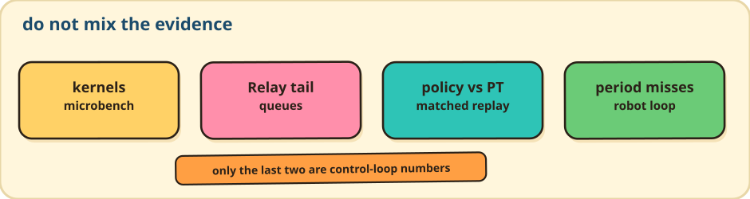

# Maintainer tools



Use one module from the checkout root:

```bash
python -m flowedge_dev --help
```

| Need | Command |
|---|---|
| Matched DP vs PyTorch | `python -m flowedge_dev bench policy` |
| Kernel mix → `data/` | `python -m flowedge_dev bench mix` |
| Size/setup budgets | `python -m flowedge_dev bench budgets` |
| ULP / diffusion / external head | `python -m flowedge_dev verify ulp\|diffusion\|head` |
| Convert / inspect / period rollout | `python -m flowedge_dev pipeline convert\|inspect\|rollout` |
| Cached SmolVLA hybrid | `python -m flowedge_dev verify smolvla` |
| GPT-2 incubator | `python -m flowedge_dev verify transformer` |
| Checkpoint JSON | `flowedge-inspect` (`tools/checkpoint_inspect.cc`) |

Scripts under `tools/` remain the implementations. The local gate is `scripts/verify_all.sh` / `scripts/verify_local.ps1`.
